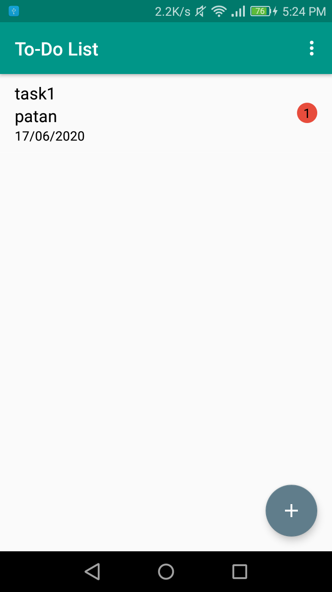
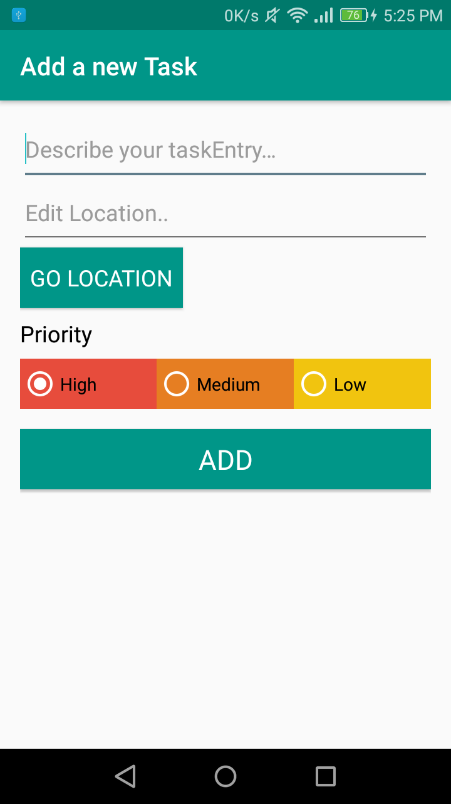
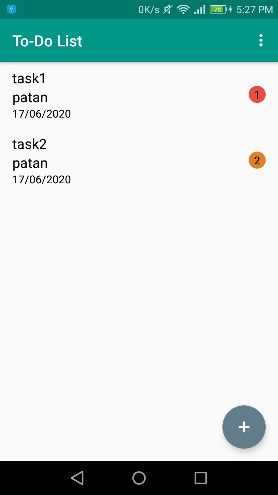
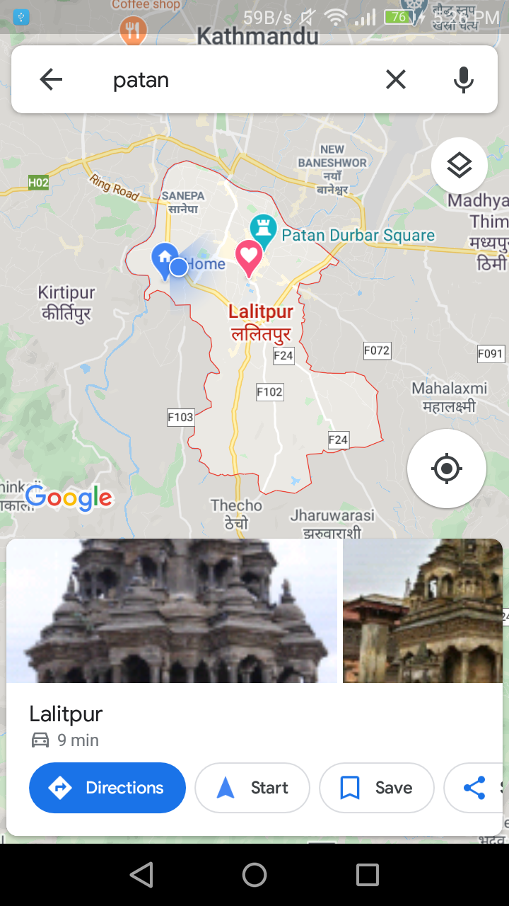
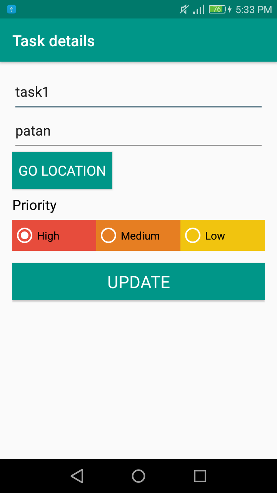
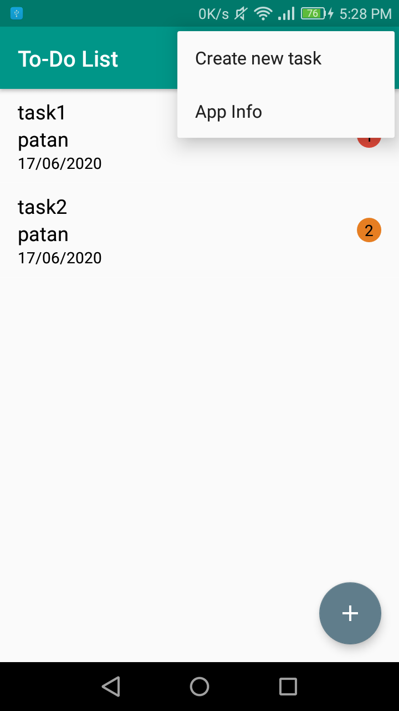
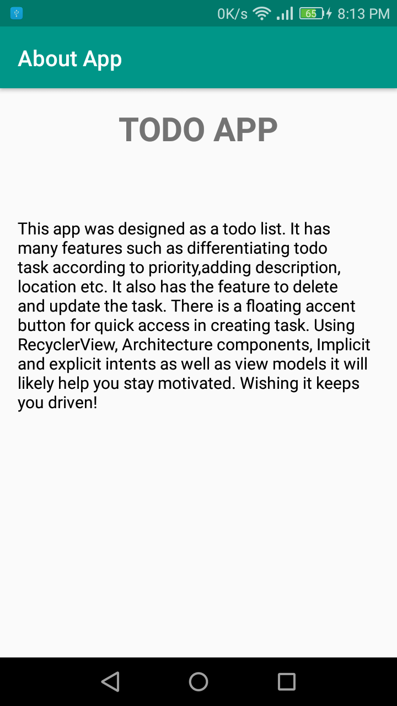

## TODO APP
## It is an android app designed to list tasks by the user and sort them by priorities. The user is able to add location and description. The user can also update and swipe to
delete tasks. The app has menu that has the information about the app. A floating accent button is for the ease of access to create a new task. The location also open ups in google maps
for a detailed view.

## Features such as fragments, implicit and explicit intents, Room, MVVM, Architecture Components, Recycler View and more make up the app. The app is capable of basic CRUD functions
and even saves data in the Room.

## App Features - Screenshot

This is the main activity of the app. When the user first opens the app, this is displayed. It has the menu, list of tasks and floating accent button. The tasks are sorted by
priorities.
The user can also swipe left or right or delete the task.

When the floating accent bar is clicked, it directs to this activity, where user can add description and location and set priority of their newly formed task.
The menu item Create new task also does the same action can they can be used according to preference.

After task is added, it redirect back to the main activity and shows in the list of task.

When clicked on the Go location button, the app directs out the info to Google Maps for a more detailed view. This is an example of implict intent.

When the pre-existing task is clicked, it takes you to an activity when you and edit and update your task.

The menu contains two menu items, the create task redirects to creating a new task and the About app will redirect to the info about the app.The latter redirection is an
example of explicit intent.

This contains the motivation behind the project and the summary of the app.